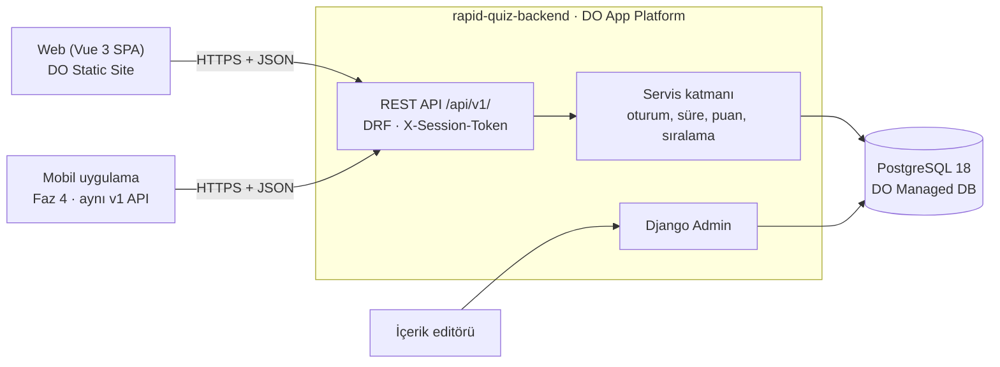

# Rapid Quiz — Proje Dokümanı

Oct 1, 2026 · @vf

## Proje özeti

Rapid Quiz, kullanıcının seçtiği kategoride 20 soruyu her biri için yalnızca 5 saniye vererek tek tek sorduğu, üyeliksiz bir hızlı bilgi yarışmasıdır. Quiz bitince puan hesaplanır, kullanıcıdan yalnızca ismi istenir ve kategori bazlı Top 10 skor tablosu gösterilir.

- **Hedef kitle:** 15–30 yaş arası, hızlı ve rekabetçi içerik seven gençler.
- **Platformlar:** Web (Vue.js) ve sonraki fazda mobil uygulama; ikisi de aynı REST API'yi kullanır.
- **Kategoriler (5):** Yazılım, Yapay Zeka, Bilgisayar Mühendisliği, Ülkeler, Fizik.
- **Soru akışı:** Kategori başına 20 soru, her ekranda tek soru; soru cevaplanmadan veya süre dolmadan sonrakine geçilemez.
- **Süre:** Soru başına 5 saniye; süre dolarsa soru yanlış/boş sayılır ve otomatik olarak sonraki soruya geçilir.
- **Kapsam dışı:** Kayıt, giriş, kullanıcı hesabı, profil, şifre. Kimlik yalnızca skor tablosuna yazılan isimdir.
- **Repolar:** `rapid-quiz-backend` (Django) ve `rapid-quiz-frontend` (Vue) ayrı Git repolarıdır.

## Teknoloji yığını ve sürümler

Tüm sürümler 1 Ekim 2026 itibarıyla güncel kararlı sürümlerdir; Django 6.1, Python 3.12–3.14 destekler, bu yüzden Python 3.14 seçildi. Bağımlılıklar `uv.lock` ve `package-lock.json` ile sabitlenir.

### Backend (`rapid-quiz-backend`)

| Bileşen | Sürüm | Kullanım |
| --- | --- | --- |
| Python | 3.14.8 | Çalışma ortamı |
| Django | 6.1.1 | Web framework, ORM, admin paneli (soru yönetimi) |
| Django REST Framework | 3.18.1 | Web ve mobil için REST API |
| PostgreSQL | 18.6 | Veritabanı |
| psycopg | 3.3.6 | PostgreSQL sürücüsü (`psycopg[binary]`) |
| drf-spectacular | 0.30.0 | OpenAPI 3 şeması + Swagger UI (mobil ekip için sözleşme) |
| django-cors-headers | 4.9.0 | Web frontend için CORS |
| django-environ | 0.14.0 | `.env` ile yapılandırma |
| gunicorn | 26.2.0 | Production WSGI sunucusu |
| pytest-django | 4.14.0 | Testler |
| uv | 0.12.21 | Paket ve sanal ortam yönetimi |

Production için ek paket: **WhiteNoise 6.12.0** (admin ve Swagger UI statik dosyalarını gunicorn üzerinden sunar). Konteyner taban imajı: `python:3.14-slim`.

### Frontend (`rapid-quiz-frontend`)

| Bileşen | Sürüm | Kullanım |
| --- | --- | --- |
| Node.js | 24.x LTS | Geliştirme ve build ortamı |
| Vue | 3.5.43 | UI framework (Composition API, `<script setup>`) |
| TypeScript | 7.0.2 | Tip güvenliği |
| Vite | 8.3.2 | Geliştirme sunucusu ve build |
| Vue Router | 5.3.1 | Sayfa yönlendirme |
| Pinia | 4.0.3 | Quiz durumu (state) yönetimi |
| Tailwind CSS | 4.3.3 | Canlı renk paleti ve responsive tasarım |
| Axios | 1.20.0 | API istemcisi |
| Vitest | 5.0.3 | Birim testler |
| Playwright | 1.63.0 | Uçtan uca (E2E) testler |
| ESLint | 10.11.0 | Kod kalitesi |

**Mobil (Faz 4):** Aynı API'yi kullanan ayrı bir uygulama. Vue bilgisini korumak için Capacitor + Vue önerilir; React Native veya Flutter da API değişmeden seçilebilir.

## Sistem mimarisi

Backend, web ve mobilin ortak kullandığı tek bir durumsuz REST API'dir; iş kuralları (süre, puan, sıralama) yalnızca servis katmanında yaşar, istemciler sadece gösterir.



Web ve mobil istemciler aynı `/api/v1/` endpointlerine bağlanır; içerik editörü soruları Django Admin üzerinden yönetir.

**Mobil uyumluluk için kararlar:**

- Cookie/CSRF yerine header tabanlı oturum token'ı (`X-Session-Token`).
- URL ile sürümlenmiş API (`/api/v1/`), eski mobil sürümler bozulmaz.
- OpenAPI şeması tek sözleşme; web ve mobil tipleri buradan üretilir.
- Tüm zaman bilgileri UTC ve ISO 8601; süre hesabı sunucu saatine göre.
- Yanıtlar küçük ve tek istekte yeterli: cevap yanıtı bir sonraki soruyu da içerir (mobil ağlarda gecikmeyi azaltır).

## Fonksiyonel gereksinimler ve kullanıcı akışı

Kullanıcı ana sayfadan skor tablosuna en fazla 22 ekranda ulaşır: kategori seçimi, 20 soru ekranı ve sonuç ekranı. Oyun durumu sunucuda tutulur; istemci yalnızca o anki soruyu bilir.

### Gereksinimler

| Kod | Gereksinim | Öncelik |
| --- | --- | --- |
| FR-01 | Ana sayfada 5 kategori kart olarak listelenir (ad, ikon, renk, kısa açıklama). | Must |
| FR-02 | Kategori seçilince sunucuda bir quiz oturumu açılır ve o kategoriden rastgele 20 soru seçilir. | Must |
| FR-03 | Her ekranda tek soru ve 4 şık gösterilir; şıkların sırası karıştırılır. | Must |
| FR-04 | Her soru için 5 saniyelik geri sayım görünür (halka/çubuk animasyonu). | Must |
| FR-05 | Soru cevaplanmadan veya süre dolmadan sonraki soru görülemez; geri dönülüp cevap değiştirilemez. | Must |
| FR-06 | Süre dolunca soru “süre doldu” olarak kaydedilir ve otomatik olarak sonraki soruya geçilir. | Must |
| FR-07 | Cevaptan sonra 0,8 sn doğru/yanlış geri bildirimi gösterilir (bu süre sayaca dahil değildir). | Should |
| FR-08 | 20. sorudan sonra puan, doğru sayısı ve toplam süre gösterilir. | Must |
| FR-09 | Kullanıcıdan isim istenir (2–20 karakter); isim girilince skor kaydedilir. | Must |
| FR-10 | Skor kaydedildikten sonra ilgili kategorinin Top 10 tablosu gösterilir; kullanıcı listedeyse satırı vurgulanır. | Must |
| FR-11 | Ana sayfadan da skor tablosu görüntülenebilir (kategori sekmeleri). | Should |
| FR-12 | “Tekrar oyna” ve “Başka kategori” butonları sonuç ekranında bulunur. | Should |
| FR-13 | Sorular, kategoriler ve şıklar Django admin panelinden yönetilir; toplu yükleme için JSON fixture/komut bulunur. | Must |
| FR-14 | Arayüz Türkçedir; metinler ileride çoklu dil için tek dosyada toplanır. | Could |

### Kullanıcı akışı

1. **Ana sayfa:** Logo, kısa slogan, 5 kategori kartı, “Skor Tablosu” butonu.
2. **Hazır ekranı:** Kategori seçilince kurallar (20 soru, soru başı 5 sn) ve 3-2-1 geri sayımı. Oturum bu sırada açılır.
3. **Soru ekranı (×20):** Üstte ilerleme (ör. 7/20), geri sayım halkası, soru metni, 4 şık butonu.
   1. Kullanıcı şıkka dokunur → cevap gönderilir → doğru/yanlış geri bildirimi → sonraki soru.
   2. 5 sn dolar → “Süre doldu!” geri bildirimi → sonraki soru.
4. **Sonuç ekranı:** Puan (animasyonlu sayım), doğru sayısı, isim giriş alanı, “Kaydet” butonu.
5. **Skor tablosu:** Kategori Top 10 listesi, kullanıcının sırası, tekrar oyna butonları.

**Sayfa yenileme / uygulamadan çıkma:** Oturum ID'si `sessionStorage`'da tutulur. Yenilemede oyun kaldığı sorudan devam eder, ancak süre sunucuda işlemeye devam ettiği için kaybedilen süre geri gelmez. 30 dakika tamamlanmayan oturumlar “süresi doldu” olarak kapatılır.

## Veritabanı modeli

Veritabanı 6 tablodan oluşur: içerik için `Category`, `Question`, `Choice`; oyun için `QuizSession`, `SessionQuestion`; skor tablosu için `LeaderboardEntry`. Kullanıcı tablosu yoktur. Django uygulamaları: `quiz` (içerik + oturum) ve `leaderboard`.

| Tablo | Alanlar | Notlar |
| --- | --- | --- |
| `Category` | `id`, `name`, `slug` (unique), `description`, `icon`, `color` (hex), `order`, `is_active` | 5 kayıt: `yazilim`, `yapay-zeka`, `bilgisayar-muhendisligi`, `ulkeler`, `fizik` |
| `Question` | `id`, `category` (FK), `text`, `difficulty` (1–3), `explanation` (ops.), `is_active`, `created_at`, `updated_at` | Kategori başına en az 20, hedef 60+ aktif soru (tekrar oynanabilirlik) |
| `Choice` | `id`, `question` (FK), `text`, `is_correct`, `order` | Soru başına tam 4 şık ve tam 1 doğru; admin'de doğrulanır + partial unique constraint (`question`, `is_correct=True`) |
| `QuizSession` | `id` (UUID), `token_hash`, `category` (FK), `status` (`in_progress`, `completed`, `expired`), `current_index` (0–20), `score`, `correct_count`, `total_time_ms`, `started_at`, `finished_at`, `client_type` (`web`, `ios`, `android`) | Oyun durumu tamamen burada; token düz metin saklanmaz |
| `SessionQuestion` | `id`, `session` (FK), `question` (FK), `order` (1–20), `choice_order` (JSON), `served_at`, `answered_at`, `selected_choice` (FK, null), `is_correct`, `timed_out`, `response_ms`, `points` | `(session, order)` unique; `served_at` sunucu saatidir |
| `LeaderboardEntry` | `id`, `session` (OneToOne), `category` (FK), `player_name`, `score`, `correct_count`, `total_time_ms`, `created_at` | İndeks: `(category, -score, total_time_ms, created_at)` |

**Neden ayrı `LeaderboardEntry`?** Skor tablosu sorgusu yalnızca tamamlanmış ve isimlendirilmiş skorları okur; tek indeksli basit bir sorgu (`ORDER BY score DESC, total_time_ms ASC LIMIT 10`) hızlı kalır. Bir oturum yalnızca bir kez skor kaydedebilir (OneToOne).

**Temizlik:** 30 günden eski tamamlanmamış oturumları silen bir `manage.py cleanup_sessions` komutu günlük cron ile çalışır.

## API tasarımı (v1)

API, web ve mobil için ortak, sürümlenmiş (`/api/v1/`), durumsuz (stateless) bir JSON REST API'dir. Cookie ve CSRF kullanılmaz; oturum, quiz başlarken dönen `session_token` ile `X-Session-Token` header'ı üzerinden taşınır. Bu, mobil istemcilerin hiçbir değişiklik olmadan aynı API'yi kullanmasını sağlar.

| Metot | Endpoint | Amaç | Header |
| --- | --- | --- | --- |
| GET | `/api/v1/categories/` | Aktif kategorileri listeler | — |
| POST | `/api/v1/sessions/` | Oturum açar, 20 soru seçer, ilk soruyu döner | — |
| GET | `/api/v1/sessions/{id}/current/` | O anki soruyu ve kalan süreyi döner (yenileme/devam için) | `X-Session-Token` |
| POST | `/api/v1/sessions/{id}/answers/` | Cevabı (veya süre dolmasını) gönderir, sonucu ve sonraki soruyu döner | `X-Session-Token` |
| GET | `/api/v1/sessions/{id}/result/` | Biten oturumun puan özetini döner | `X-Session-Token` |
| POST | `/api/v1/sessions/{id}/score/` | İsmi kaydeder, skor tablosuna ekler, sıralamayı döner | `X-Session-Token` |
| GET | `/api/v1/leaderboard/?category={slug}` | Kategorinin Top 10 listesi | — |
| GET | `/api/v1/health/` | Sağlık kontrolü (deploy/monitoring) | — |
| GET | `/api/schema/`, `/api/docs/` | OpenAPI 3 şeması ve Swagger UI | — |

### Örnek: oturum açma

```json
POST /api/v1/sessions/
{ "category": "yapay-zeka", "client_type": "web" }

201 Created
{
  "session_id": "8f1c…",
  "session_token": "tok_…",
  "total_questions": 20,
  "time_limit_ms": 5000,
  "question": {
    "index": 1,
    "id": 412,
    "text": "Transformer mimarisini tanıtan makale hangisidir?",
    "choices": [ { "id": 1631, "text": "…" }, { "id": 1629, "text": "…" }, { "id": 1630, "text": "…" }, { "id": 1632, "text": "…" } ],
    "served_at": "2026-10-01T12:00:00.000Z"
  }
}
```

### Örnek: cevap gönderme

```json
POST /api/v1/sessions/{id}/answers/
{ "question_id": 412, "choice_id": 1630 }      // süre dolduysa "choice_id": null

200 OK
{
  "is_correct": true,
  "correct_choice_id": 1630,
  "timed_out": false,
  "points": 132,
  "score": 132,
  "finished": false,
  "next_question": { "index": 2, … }
}
```

### Kurallar

- Soru yanıtlarında `is_correct` bilgisi asla soru ile birlikte gönderilmez; doğru şık yalnızca cevaptan sonra döner.
- `question_id` o anki soruyla eşleşmezse `409 Conflict` döner (eski/tekrarlanan istek).
- Hata formatı sabittir: `{ "error": { "code": "session_expired", "message": "…" } }`.
- Rate limit (DRF throttling): oturum açma IP başına 30/dk, cevap gönderme 120/dk, skor kaydetme 10/dk.
- CORS yalnızca web frontend domain'ine açıktır; mobil istemciler CORS'tan etkilenmez.
- Geriye dönük uyumsuz bir değişiklik `/api/v2/` ile yayınlanır; mobil uygulamaların eski sürümleri v1'i kullanmaya devam eder.
- OpenAPI şemasından TypeScript tipleri üretilir (`openapi-typescript`); mobil ekip de aynı şemayı kullanır.

## Oyun kuralları, puanlama ve hile önleme

Puan tamamen sunucuda, sunucu saatine göre hesaplanır; bir quizden en fazla 3.000 puan alınabilir. Doğru cevap 100 taban puan ve kalan süreye göre en fazla 50 hız bonusu getirir.

```latex
\text{puan} = 100 + \left\lfloor 50 \cdot \frac{5000 - \text{response\_ms}}{5000} \right\rfloor
```

| Durum | Puan |
| --- | --- |
| Doğru, 0,5 sn'de | 145 |
| Doğru, 1,8 sn'de | 132 |
| Doğru, 4,9 sn'de | 101 |
| Yanlış cevap | 0 |
| Süre doldu | 0 |

**Sıralama:** Önce puan (büyükten küçüğe), eşitlikte toplam cevap süresi (az olan önde), sonra kayıt zamanı (erken olan önde).

### Süre yönetimi

- Soru istemciye gönderildiğinde `served_at` sunucuda kaydedilir; `response_ms = answered_at − served_at` hesaplanır.
- Ağ gecikmesi için sunucu 750 ms tolerans tanır: 5.750 ms'ye kadar gelen cevap geçerlidir, puan hesabında `response_ms` en fazla 5.000 alınır.
- Toleransı aşan cevap “süre doldu” sayılır, istemci ne gönderirse göndersin.
- İstemcideki sayacın görevi yalnızca görsel geri sayım ve süre dolunca `choice_id: null` göndermektir.

### Hile önleme

- Doğru şık bilgisi soru ile istemciye gitmez.
- Sonraki soru yalnızca o anki soru cevaplandıktan / süresi dolduktan sonra sunucudan alınır; 20 soru tek seferde gönderilmez.
- Bir soruya ikinci cevap kabul edilmez (idempotent: aynı cevap tekrar gelirse ilk sonuç döner).
- `session_token` yalnızca bir kez döner, veritabanında hash olarak saklanır.
- Skor yalnızca `completed` durumdaki oturum için ve bir kez kaydedilebilir.
- İsim temizlenir: baş/son boşluk silinir, 2–20 karakter, HTML/emoji dışı karakter sınırı, küfür listesi kontrolü.
- Rate limit ile otomatik oturum açma/spam engellenir.

### Soru içeriği kuralları

- Soru metni en fazla 120, şık metni en fazla 40 karakter: 5 saniyede okunabilir olmalı.
- Her kategoride ilk sürüm için en az 20, hedef 60 soru; oturum bunlardan rastgele 20 seçer (zorluk dağılımı: 8 kolay, 8 orta, 4 zor).

## UI/UX tasarım rehberi

Tasarım açık zeminli, canlı ve enerjik olur: beyaza yakın arka plan üzerinde doygun renkli kartlar, yumuşak gradyanlar ve hızlı mikro animasyonlar. Koyu tema varsayılan değildir. Mobil öncelikli (mobile-first) tasarlanır; aynı dil mobil uygulamada da kullanılır.

### Renk paleti

| Token | Hex | Kullanım |
| --- | --- | --- |
| `bg` | `#FFF8F1` | Sayfa arka planı (sıcak krem) |
| `surface` | `#FFFFFF` | Kart ve soru kutusu |
| `ink` | `#1E1B4B` | Ana metin (lacivert, siyah yerine) |
| `primary` | `#7C3AED` | Ana buton, logo, ilerleme çubuğu |
| `accent` | `#FF4D8D` | Vurgu, “Rapid” enerjisi, skor animasyonu |
| `success` | `#22C55E` | Doğru cevap |
| `danger` | `#EF4444` | Yanlış cevap, son 1 saniye |
| `warning` | `#FACC15` | Sayaç 2 sn altı |

### Kategori renkleri

| Kategori | Renk | İkon fikri |
| --- | --- | --- |
| Yazılım | `#3B82F6` mavi | `</>` kod parantezi |
| Yapay Zeka | `#A855F7` mor | Beyin / kıvılcım |
| Bilgisayar Mühendisliği | `#F97316` turuncu | İşlemci (chip) |
| Ülkeler | `#10B981` yeşil | Dünya |
| Fizik | `#06B6D4` camgöbeği | Atom |

### Tipografi ve bileşenler

- **Font:** Başlıklar *Space Grotesk* (700), metin *Plus Jakarta Sans* (400/600). Soru metni mobilde en az 20 px.
- **Köşeler:** Kartlar 24 px, butonlar 16 px yuvarlatılmış; hafif renkli gölge (kategori renginde %25).
- **Şık butonları:** Tam genişlik, en az 56 px yüksekliğin dokunma alanı, A/B/C/D rozetleri; mobilde tek sütun, masaüstünde 2×2 grid.
- **Geri sayım:** Soru üstünde dairesel halka; 5→2 sn yeşil, 2→1 sarı, son 1 sn kırmızı ve hafif titreşim (mobilde haptic).
- **İlerleme:** Üstte 20 parçalı çubuk; doğru parçalar yeşil, yanlış/süre dolan kırmızı.
- **Geri bildirim:** Doğru cevapta kısa konfeti/pulse ve “+132” uçan puan; yanlışta şık sallanır ve doğru şık yeşil yanıp söner.
- **Skor tablosu:** İlk 3 sıra altın/gümüş/bronz rozetli podyum; 4–10 liste; kullanıcının satırı `accent` çerçeveli.

### Erişilebilirlik ve performans

- Metin/arka plan kontrastı WCAG AA (4.5:1); renkli butonlarda metin beyaz ve kalın.
- Doğru/yanlış yalnızca renkle değil ikonla da (✓ / ✕) belirtilir.
- `prefers-reduced-motion` açıksa konfeti ve sallanma kapatılır.
- Klavye: 1–4 veya A–D tuşları şık seçer (masaüstü).
- Soru geçişi 150 ms altında hissedilmeli; bir sonraki soru cevap yanıtıyla birlikte geldiği için ek istek beklenmez.

## Repo yapıları, geliştirme ortamı, test ve deploy

İki repo birbirinden bağımsız geliştirilir, test edilir ve deploy edilir; aralarındaki tek sözleşme OpenAPI şemasıdır. Her repoda Claude Code için proje kurallarını anlatan bir `CLAUDE.md` bulunur.

### `rapid-quiz-backend`

```
rapid-quiz-backend/
├── CLAUDE.md
├── .do/
│   └── app.yaml            # DigitalOcean App Platform spec (api, migrate, cleanup, db)
├── .github/workflows/ci.yml
├── pyproject.toml          # uv ile bağımlılıklar
├── uv.lock
├── .env.example
├── .dockerignore
├── Dockerfile              # multi-stage, gunicorn, port 8080
├── docker-compose.yml      # yerel: postgres:18 + api
├── manage.py
├── config/
│   ├── settings/ (base.py, dev.py, prod.py, test.py)
│   ├── middleware.py       # HealthCheckMiddleware
│   ├── urls.py
│   └── wsgi.py
├── apps/
│   ├── quiz/
│   │   ├── models.py       # Category, Question, Choice, QuizSession, SessionQuestion
│   │   ├── services.py     # oturum açma, cevap değerlendirme, puan hesabı
│   │   ├── serializers.py
│   │   ├── views.py
│   │   ├── admin.py
│   │   ├── management/commands/ (load_questions.py, cleanup_sessions.py)
│   │   └── tests/
│   └── leaderboard/
│       ├── models.py       # LeaderboardEntry
│       ├── serializers.py
│       ├── views.py
│       └── tests/
└── data/questions/         # yazilim.json, yapay-zeka.json, …
```

### `rapid-quiz-frontend`

```
rapid-quiz-frontend/
├── CLAUDE.md
├── .do/
│   └── app.yaml            # DigitalOcean Static Site spec
├── .github/workflows/ci.yml
├── package.json            # "engines": { "node": "24.x" }
├── vite.config.ts
├── .env.example            # VITE_API_BASE_URL
├── src/
│   ├── main.ts
│   ├── App.vue
│   ├── api/                # axios istemcisi + OpenAPI'den üretilen tipler
│   ├── stores/quiz.ts      # Pinia: oturum, o anki soru, puan
│   ├── composables/useCountdown.ts
│   ├── router/index.ts     # history mode (catchall_document: index.html)
│   ├── views/              # HomeView, ReadyView, QuestionView, ResultView, LeaderboardView
│   ├── components/         # CategoryCard, CountdownRing, ChoiceButton, ProgressBar, Podium
│   ├── assets/styles/      # Tailwind tema token'ları
│   └── i18n/tr.ts
└── tests/ (unit/, e2e/)
```

### Yerel geliştirme

1. Backend: `docker compose up -d db` → `uv sync` → `uv run manage.py migrate` → `uv run manage.py load_questions` → `uv run manage.py runserver` (port 8000).
2. Frontend: `npm install` → `.env` içinde `VITE_API_BASE_URL=http://localhost:8000` → `npm run dev` (port 5173).
3. API dokümantasyonu: `http://localhost:8000/api/docs/`.

### Ortam değişkenleri (backend)

`DJANGO_SECRET_KEY`, `DJANGO_DEBUG`, `DJANGO_ALLOWED_HOSTS`, `DATABASE_URL`, `CORS_ALLOWED_ORIGINS`, `QUIZ_TIME_LIMIT_MS` (5000), `QUIZ_LATENCY_GRACE_MS` (750), `QUIZ_QUESTIONS_PER_SESSION` (20).

Production'da bunlara ek olarak `CSRF_TRUSTED_ORIGINS`, `WEB_CONCURRENCY` (gunicorn worker sayısı) ve `PORT` (8080) kullanılır; tüm değerler DigitalOcean App spec'inden gelir, `DJANGO_SECRET_KEY` SECRET olarak saklanır.

### Test stratejisi

| Katman | Araç | Kapsam |
| --- | --- | --- |
| Backend birim/servis | pytest-django | Puan hesabı, süre toleransı, tekrar cevap, oturum bitişi, sıralama |
| Backend API | DRF `APIClient` | Her endpoint için başarı + hata kodları; zaman `time-machine` ile dondurulur |
| Frontend birim | Vitest + Vue Test Utils | `useCountdown`, quiz store, bileşenler |
| Uçtan uca | Playwright | Ana sayfa → 20 soru → isim → Top 10 (mobil ve masaüstü viewport) |

Hedef: backend servis katmanında %90+ kapsama.

### CI

- Her repoda GitHub Actions: PR'da lint (ruff / ESLint), testler ve build çalışır; backend'de ayrıca `docker build` denenir.
- `main` dalı korumalıdır: CI yeşil olmadan merge edilemez. DigitalOcean `main`'e her push'ta otomatik deploy eder.

## DigitalOcean deploy

Backend, DigitalOcean App Platform'da Dockerfile ile build edilen bir **Web Service** (App), frontend aynı platformda **Static Site** olarak çalışır; veritabanı DigitalOcean Managed PostgreSQL 18'dir. Her repo kendi `.do/app.yaml` dosyasıyla ayrı bir App olarak tanımlanır ve `main` dalına push'ta otomatik deploy edilir. Bölge: `fra` (Frankfurt, Türkiye'ye en yakın).

| Bileşen | DigitalOcean türü | Repo | Domain | Ayrıntı |
| --- | --- | --- | --- | --- |
| `api` | App Platform Web Service (Dockerfile) | `rapid-quiz-backend` | `api.rapidquiz.app` | gunicorn, port 8080, health check `/api/v1/health/` |
| `migrate` | App Platform PRE\_DEPLOY job | `rapid-quiz-backend` | — | Her deploy öncesi `migrate`; başarısız olursa deploy durur, eski sürüm çalışmaya devam eder |
| `cleanup-sessions` | App Platform SCHEDULED job | `rapid-quiz-backend` | — | Her gün 04:00 (Europe/Istanbul) `cleanup_sessions` |
| `db` | Managed PostgreSQL 18 cluster | — | Yalnızca özel ağ | Trusted sources = backend App; SSL zorunlu |
| `web` | App Platform Static Site (Spaces CDN) | `rapid-quiz-frontend` | `rapidquiz.app` | `npm ci && npm run build`, `dist/`, SPA için `catchall_document: index.html` |

### Backend `Dockerfile`

Çok aşamalı (multi-stage) build: bağımlılıklar uv ile kurulur, son imajda yalnızca sanal ortam ve kod bulunur, uygulama root olmayan kullanıcıyla çalışır. App Platform yalnızca Linux AMD64 imajları çalıştırır ve imaj 2 GiB'ın altında tutulmalıdır.

```dockerfile
# syntax=docker/dockerfile:1
FROM python:3.14-slim AS builder
COPY --from=ghcr.io/astral-sh/uv:0.12 /uv /uvx /bin/
ENV UV_COMPILE_BYTECODE=1 UV_LINK_MODE=copy UV_PYTHON_DOWNLOADS=never
WORKDIR /app
COPY pyproject.toml uv.lock ./
RUN uv sync --frozen --no-dev --no-install-project
COPY . .
RUN uv sync --frozen --no-dev

FROM python:3.14-slim
ENV PYTHONDONTWRITEBYTECODE=1 \
    PYTHONUNBUFFERED=1 \
    PATH="/app/.venv/bin:$PATH" \
    DJANGO_SETTINGS_MODULE=config.settings.prod \
    PORT=8080
RUN useradd --create-home --uid 1000 app
WORKDIR /app
COPY --from=builder --chown=app:app /app /app
# collectstatic DB'ye bağlanmaz; build sırasında sahte değerler yeterli
RUN DJANGO_SECRET_KEY=build-only DATABASE_URL=sqlite:////tmp/build.db \
    python manage.py collectstatic --noinput
USER app
EXPOSE 8080
CMD ["sh", "-c", "gunicorn config.wsgi:application --bind 0.0.0.0:${PORT} --workers ${WEB_CONCURRENCY:-3} --access-logfile - --error-logfile -"]
```

`.dockerignore`: `.git`, `.venv`, `__pycache__`, `*.pyc`, `.env`, `.pytest_cache`, `htmlcov`, `docs`.

### Yerel `docker-compose.yml`

Yerelde de production ile aynı Dockerfile kullanılır; böylece “bende çalışıyordu” farkları azalır. Günlük geliştirmede yalnızca `db` servisi açılıp `runserver` kullanılabilir.

```yaml
services:
  db:
    image: postgres:18
    environment:
      POSTGRES_DB: rapidquiz
      POSTGRES_USER: rapidquiz
      POSTGRES_PASSWORD: rapidquiz
    ports: ["5432:5432"]
    volumes:
      - pgdata:/var/lib/postgresql   # PG 18 imajında veri dizini bu klasörün altında
    healthcheck:
      test: ["CMD-SHELL", "pg_isready -U rapidquiz"]
      interval: 5s
      retries: 10
  api:
    build: .
    env_file: .env
    environment:
      DJANGO_SETTINGS_MODULE: config.settings.dev
      DATABASE_URL: postgres://rapidquiz:rapidquiz@db:5432/rapidquiz
    ports: ["8000:8080"]
    depends_on:
      db:
        condition: service_healthy
volumes:
  pgdata:
```

### Backend `.do/app.yaml`

Tüm componentlerin ortak ihtiyacı olan değişkenler app seviyesindeki `envs` altında tanımlanır. `DJANGO_SECRET_KEY` spec dosyasına yazılmaz; DigitalOcean panelinden SECRET olarak girilir.

```yaml
name: rapid-quiz-api
region: fra
domains:
  - domain: api.rapidquiz.app
    type: PRIMARY
envs:
  - key: DJANGO_SETTINGS_MODULE
    value: config.settings.prod
  - key: DJANGO_SECRET_KEY
    scope: RUN_TIME
    type: SECRET            # değer panelden girilir
  - key: DATABASE_URL
    scope: RUN_TIME
    value: ${db.DATABASE_URL}
services:
  - name: api
    github:
      repo: <github-kullanici>/rapid-quiz-backend
      branch: main
      deploy_on_push: true
    dockerfile_path: Dockerfile
    http_port: 8080
    instance_count: 1
    instance_size_slug: apps-s-1vcpu-1gb
    health_check:
      http_path: /api/v1/health/
      initial_delay_seconds: 10
      period_seconds: 10
    envs:
      - key: DJANGO_ALLOWED_HOSTS
        value: api.rapidquiz.app,${APP_DOMAIN}
      - key: CORS_ALLOWED_ORIGINS
        value: https://rapidquiz.app
      - key: CSRF_TRUSTED_ORIGINS
        value: https://api.rapidquiz.app
      - key: WEB_CONCURRENCY
        value: "3"
jobs:
  - name: migrate
    kind: PRE_DEPLOY
    github:
      repo: <github-kullanici>/rapid-quiz-backend
      branch: main
    dockerfile_path: Dockerfile
    run_command: python manage.py migrate --noinput
    instance_size_slug: apps-s-1vcpu-0.5gb
  - name: cleanup-sessions
    kind: SCHEDULED
    schedule:
      cron: "0 4 * * *"
      time_zone: Europe/Istanbul
    github:
      repo: <github-kullanici>/rapid-quiz-backend
      branch: main
    dockerfile_path: Dockerfile
    run_command: python manage.py cleanup_sessions
    instance_size_slug: apps-s-1vcpu-0.5gb
databases:
  - name: db
    engine: PG
    version: "18"
    production: true
    cluster_name: rapid-quiz-db
```

### Frontend `.do/app.yaml`

`VITE_API_BASE_URL` build sırasında koda gömülür, bu yüzden kapsamı `BUILD_TIME`'dır. Node sürümü `package.json` içinde `"engines": { "node": "24.x" }` ile sabitlenir.

```yaml
name: rapid-quiz-web
region: fra
domains:
  - domain: rapidquiz.app
    type: PRIMARY
static_sites:
  - name: web
    github:
      repo: <github-kullanici>/rapid-quiz-frontend
      branch: main
      deploy_on_push: true
    environment_slug: node-js
    build_command: npm ci && npm run build
    output_dir: dist
    catchall_document: index.html   # Vue Router history mode için
    envs:
      - key: VITE_API_BASE_URL
        scope: BUILD_TIME
        value: https://api.rapidquiz.app
```

### Django production ayarları (`config/settings/prod.py`)

- `DEBUG = False`; `ALLOWED_HOSTS`, `CORS_ALLOWED_ORIGINS`, `CSRF_TRUSTED_ORIGINS` ortam değişkenlerinden okunur.
- HTTPS'i DigitalOcean'ın yük dengeleyicisi sonlandırır: `SECURE_PROXY_SSL_HEADER = ("HTTP_X_FORWARDED_PROTO", "https")`, `SESSION_COOKIE_SECURE` ve `CSRF_COOKIE_SECURE` açık, HSTS 1 yıl. `SECURE_SSL_REDIRECT` kapalı kalır (yönlendirmeyi platform yapar; health check'i bozmamak için).
- **Health check:** DigitalOcean kontrol isteklerini konteyner IP'siyle gönderebilir ve `ALLOWED_HOSTS` bunu reddeder. Bu yüzden `/api/v1/health/` yolunu `MIDDLEWARE` listesinin en başında duran küçük bir `HealthCheckMiddleware` yanıtlar (DB'ye `SELECT 1` atar, 200 döner).
- Veritabanı: `DATABASE_URL` (`sslmode=require` içerir) `django-environ` ile okunur; `CONN_MAX_AGE=60`, `CONN_HEALTH_CHECKS=True`. Birden fazla instance'a çıkılırsa DigitalOcean connection pool (PgBouncer, transaction mode) eklenir ve `DISABLE_SERVER_SIDE_CURSORS=True` yapılır.
- Statik dosyalar (admin, Swagger UI): WhiteNoise, `SecurityMiddleware`'den hemen sonra; `STORAGES["staticfiles"]` = `CompressedManifestStaticFilesStorage`.
- Loglar JSON formatında stdout'a yazılır; DigitalOcean Runtime Logs'ta görünür.
- Konteyner dosya sistemi geçicidir: kalıcı hiçbir veri diske yazılmaz (kullanıcı yüklemesi yok, sorular DB'de).

### İlk kurulum adımları

1. DigitalOcean hesabına GitHub erişimi verilir; `doctl` CLI kurulur ve `doctl auth init` yapılır.
2. Backend: `doctl apps create --spec .do/app.yaml` → PostgreSQL 18 cluster oluşur, build başlar.
3. Panelde `DJANGO_SECRET_KEY` SECRET olarak girilir; deploy yeniden tetiklenir, `migrate` job'ı çalışır.
4. App Console'dan: `python manage.py createsuperuser` ve `python manage.py load_questions`.
5. Frontend: `doctl apps create --spec .do/app.yaml`.
6. DNS: `rapidquiz.app` ve `api.rapidquiz.app` DigitalOcean'a yönlendirilir; SSL sertifikaları otomatik alınır.
7. Sonraki deploylar `main`'e push ile otomatik olur; spec değişikliği `doctl apps update <app-id> --spec .do/app.yaml` ile uygulanır. Sorunlu deploy panelden tek tıkla önceki sürüme geri alınır (rollback).

## Yol haritası ve Claude Code ile geliştirme

Geliştirme 4 fazda ilerler: önce API, sonra web, ardından yayın ve en son mobil. Her adım Claude Code'a tek, test edilebilir bir görev olarak verilir; bu doküman her iki reponun `CLAUDE.md` dosyasına referans olarak eklenir.

### Faz 1 — Backend API

- [ ] Django 6.1 projesini uv ile kur; `config/settings` bölünmüş ayarlar, PostgreSQL 18 docker-compose, Dockerfile ve .do/app.yaml.
- [ ] `quiz` ve `leaderboard` modelleri, migration'lar ve admin ekranları (inline şıklar, tek doğru şık doğrulaması).
- [ ] `load_questions` komutu + 5 kategori için 20'şer soruluk JSON verisi.
- [ ] Servis katmanı: oturum açma, cevap değerlendirme, süre toleransı, puan hesabı (önce testler).
- [ ] v1 endpointleri, hata formatı, throttling, CORS.
- [ ] drf-spectacular ile OpenAPI şeması ve Swagger UI.

### Faz 2 — Web frontend

- [ ] Vite + Vue 3 + TypeScript + Tailwind + Pinia + Router kurulumu; tema token'ları.
- [ ] OpenAPI'den tip üretimi ve axios istemcisi.
- [ ] Ana sayfa ve kategori kartları.
- [ ] Hazır ekranı + soru ekranı (`CountdownRing`, `ChoiceButton`, `ProgressBar`).
- [ ] Sonuç ekranı + isim formu + skor tablosu (podyum).
- [ ] Yenileme/devam senaryosu, animasyonlar, erişilebilirlik.
- [ ] Vitest ve Playwright testleri.

### Faz 3 — Yayın

- [ ] GitHub Actions CI (her iki repo).
- [ ] Backend'i DigitalOcean App Platform'a (Dockerfile + Managed PostgreSQL 18), frontend'i DigitalOcean Static Site olarak deploy et; domain ve SSL ayarları.
- [ ] Soruları kategori başına 60'a çıkar.

### Faz 4 — Mobil uygulama

- [ ] Mobil teknoloji kararı (Capacitor + Vue / React Native / Flutter).
- [ ] Aynı v1 API ile oyun akışı; `client_type` ile web/mobil ayırımı.
- [ ] Haptic geri bildirim, uygulama arka plana alınınca oturum kuralı.

### Claude Code için örnek ilk komut (backend)

```
Bu repo Rapid Quiz backend'i. Proje dokümanı docs/PROJECT.md içinde.
Django 6.1.1, DRF 3.18.1, Python 3.14, PostgreSQL 18 kullan.
Faz 1'in ilk iki maddesini yap: projeyi uv ile kur, docker-compose'a postgres:18 ekle,
quiz ve leaderboard modellerini dokümandaki tabloya göre oluştur, admin'i yapılandır.
Her model için pytest testleri yaz ve çalıştır. Bitince CLAUDE.md'yi güncelle.
```

### Açık sorular

- Skor tablosu yalnızca kategori bazında mı olacak, yoksa tüm kategorilerin toplamı için genel bir Top 10 da olacak mı?
- Aynı isim skor tablosunda birden fazla kez yer alabilir mi, yoksa isim başına en iyi skor mu gösterilecek?
- Mobil için teknoloji tercihi (Capacitor, React Native, Flutter).

## Kaynaklar

- [Django — Download (6.1.1)](https://www.djangoproject.com/download/)
- [Django 6.1 released](https://www.djangoproject.com/weblog/2026/aug/05/django-61-released/)
- [endoflife.date — Python](https://endoflife.date/python)
- [endoflife.date — Vue](https://endoflife.date/vue)
- [endoflife.date — PostgreSQL](https://endoflife.date/postgresql)
- [endoflife.date — Node.js](https://endoflife.date/nodejs)
- [PyPI — djangorestframework](https://pypi.org/project/djangorestframework/) ve npm kayıt defteri (Vite, Vue Router, Pinia, Tailwind vb. sürümleri)
- [DigitalOcean — App Spec Reference](https://docs.digitalocean.com/products/app-platform/reference/app-spec/)
- [DigitalOcean — Cron ve deploy job'ları](https://docs.digitalocean.com/products/app-platform/how-to/manage-jobs/)
- [DigitalOcean — App Platform limitleri](https://docs.digitalocean.com/products/app-platform/details/limits/)
- [DigitalOcean — Managed PostgreSQL desteklenen eklentiler (PG 16–18)](https://docs.digitalocean.com/products/databases/postgresql/details/supported-extensions/)
